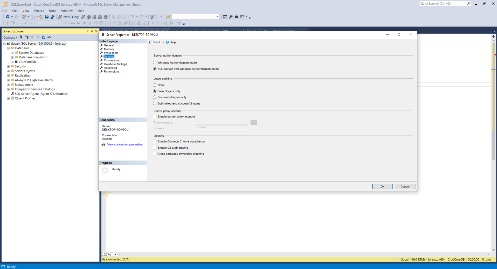
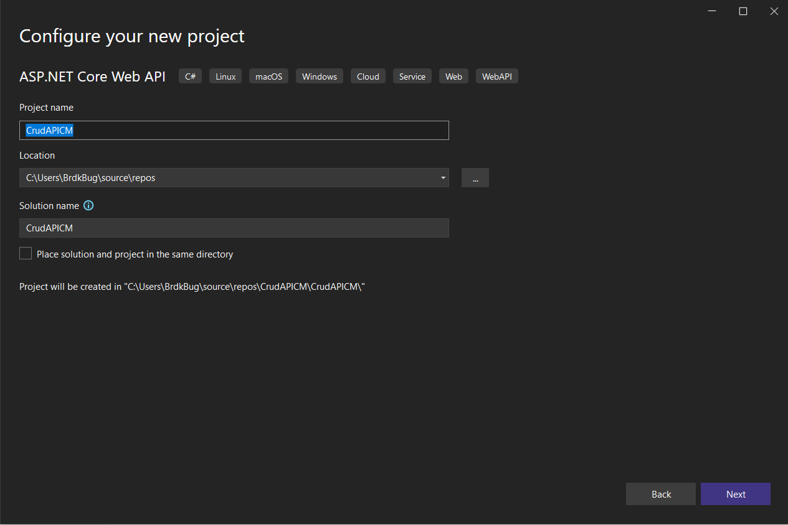
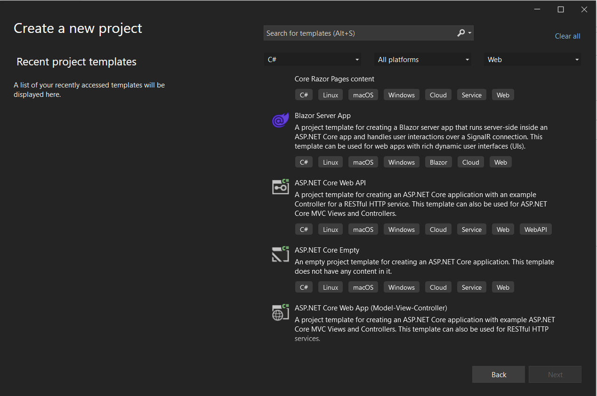
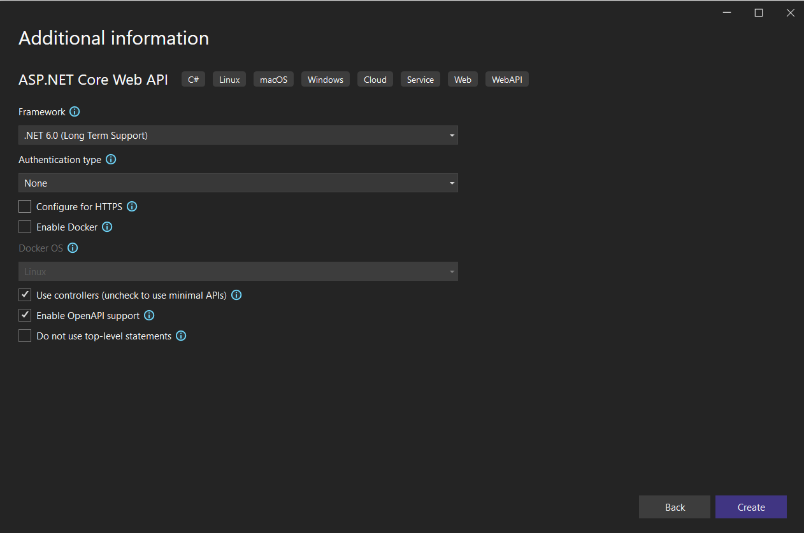
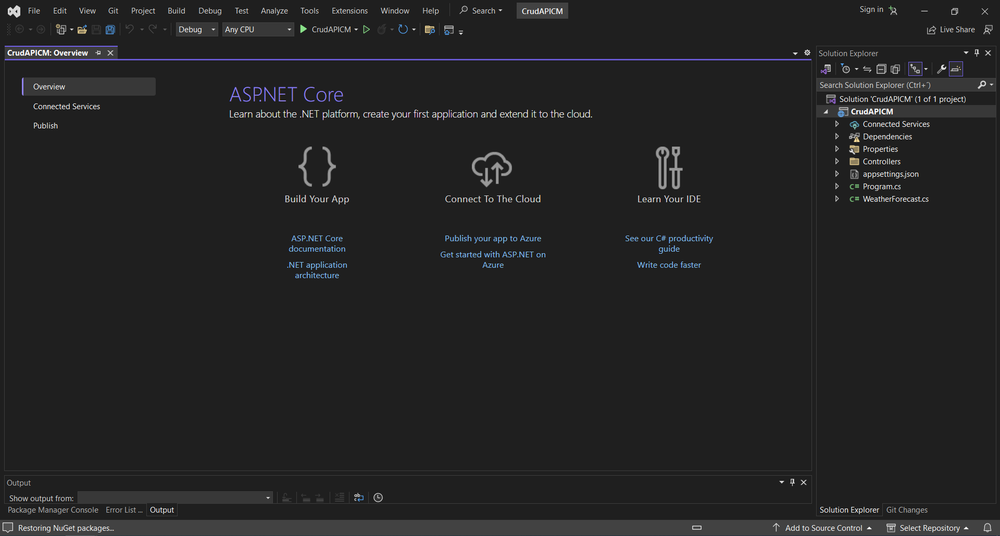
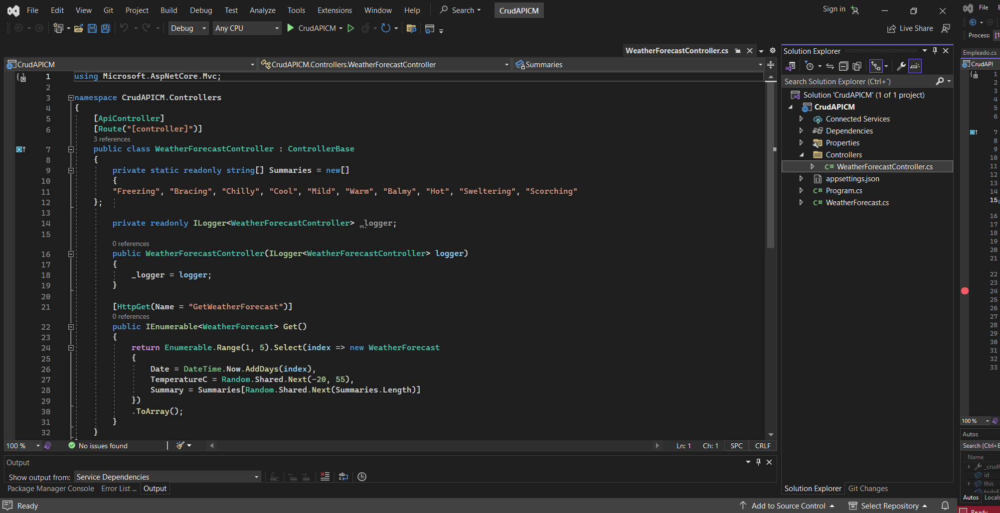
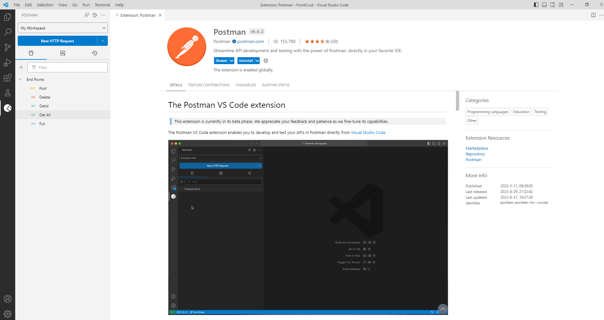

# CrudAPI
Desacoplando el Front-End 

<!-- TABLE OF CONTENTS -->
<details open="open">
  <summary>Tabla de Contenido</summary>
  <ol>
    <li>
      <a href="#Acerca del Proyecto">Acerca del Proyecto</a>
    </li>
    <li>
      <a href="#El archivo principal>El archivo principal</a>
      <ul>
        <li><a href="#Prerrequisitos">Diagramado de Interfaz grafica de usuario (GUI) Web con Balsamiq</a></li>
        <li><a href="#Prerrequisitos">Modelado de bases de datos relacionales en UML</a></li>
        <li><a href="#Prerrequisitos">Creación de la Base de Datos en SQL Managment Studio</a></li>
        <li><a href="#Prerrequisitos">Creación Proyecto con Visual Studio tipo API Web Core 6.0</a></li>
        <li><a href="#Prerrequisitos">Creación modelos mediante Object Relacional Mapping (ORM) Entitiy Framework modo Databasefirst</a></li>
        <li><a href="#Prerrequisitos">Testeo manual de end-points "Get, Post, Put, Delete" mediante Visual Code extension Postman </a></li>
        <li><a href="#TODO">TODO</a></li>
        <li><a href="#Tecnologias">Tecnologías</a></li>
      </ul>
    </li>
  </ol>
</details>

## SQL Query
 
``` sql
/* Creacion de la base de datos */
Create Database ControlAutosDB

/* Seleccion base de datos a trabajar */
Use ControlAutosDB;

/* creacion de tabla */
Create Table Ruta(
	IdRuta int primary key identity(1,1),
	NombreRuta varchar(60) not null,
	InicioRuta varchar(60) not null,
	Estatus   bit not null,		
)

/* creacion de tabla */
Create Table DestinoRuta(
	IdDestino int primary key identity(1,1),
	Destino varchar(100) not null,
	Estatus   bit not null,		
	IdRuta int not null,
	CONSTRAINT FK_Cargo FOREIGN KEY (IdRuta) REFERENCES Ruta(IdRuta)
)
-- Columna Estatus nota:
--No existe el tipo de dato boolean, pero sí el tipo de dato bit. 
--Y un bit, como todos sabemos, puede ser un 1 o un 0.

/* insercion en tabla */
Insert into Ruta(NombreRuta,InicioRuta, Estatus) VALUES ('Rio Sonora','29.07447500276877, -110.94526290893555',1)

/* insercion en tabla */
Insert into DestinoRuta(Destino, Estatus, IdRuta) VALUES 
('29.07447500276877, -111.00105285644531', 1, 1),
('29.094127073996578, -110.93273162841798', 1,1 ),
('29.094127073996578, -110.93273162841798', 1, 1)

select * from Ruta;
select * from DestinoRuta;
```


<!-- PROJECT LOGO -->
<br />

<p align="center">
  <a>
    
  </a>  
</p>

<p align="center">
  <a>
    
  </a>  
</p>

<p align="center">
  <a>
    
  </a>
</p>

<p align="center">
  <a>
    
  </a>
</p>

<p align="center">
  <a>
    
  </a>
</p>

<p align="center">
  <a>
    
  </a>
</p>

<p align="center">
  <a>
    
  </a>
</p>
