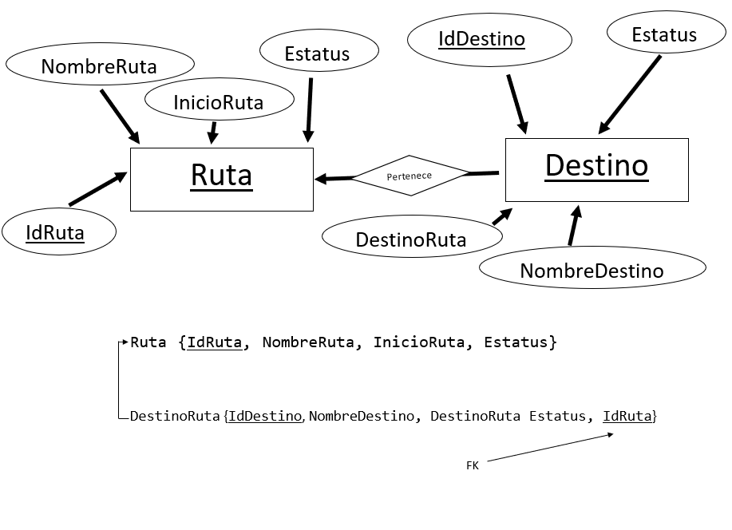
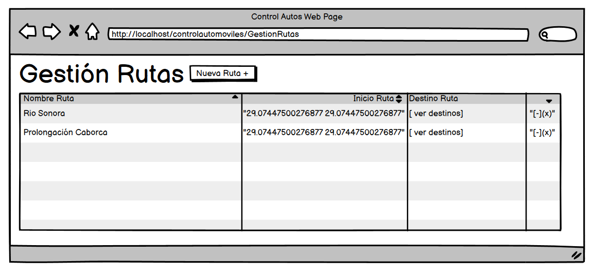
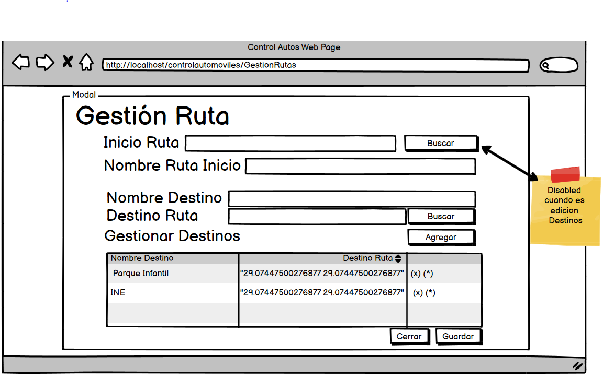
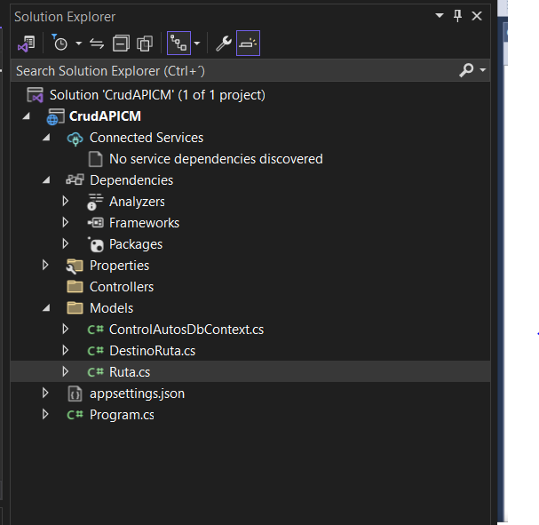
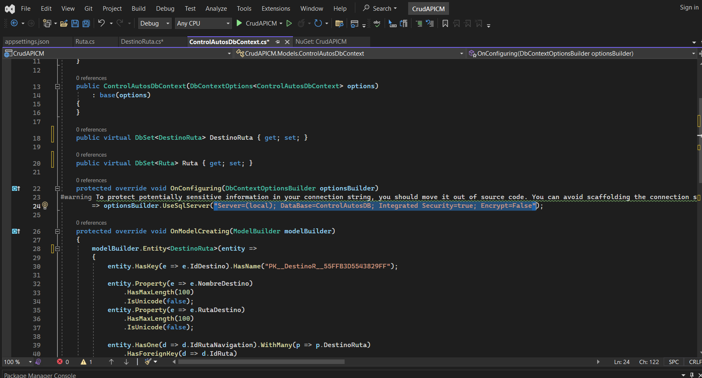
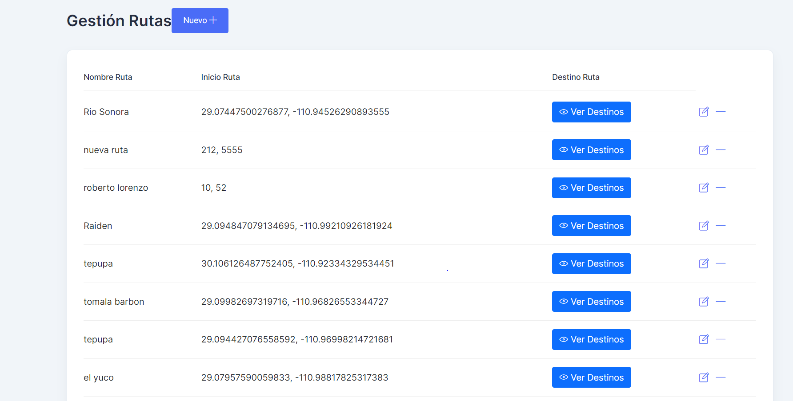
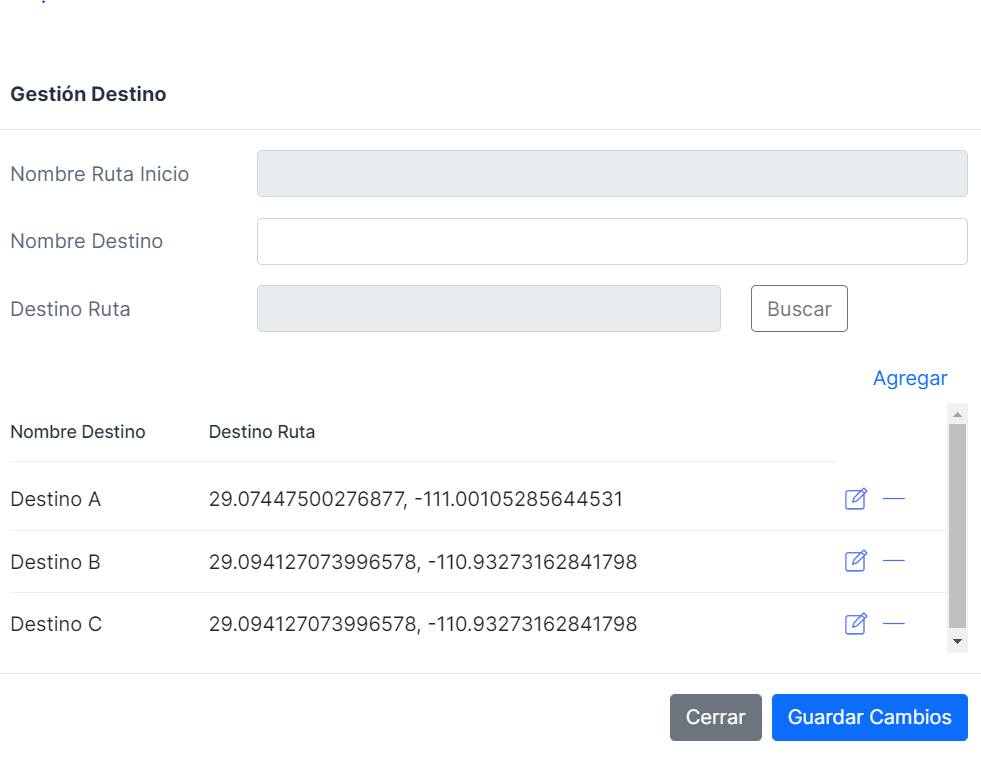
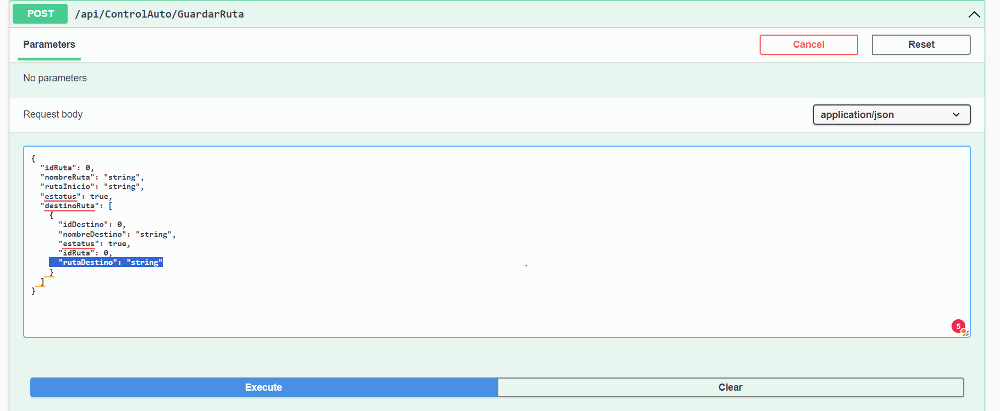
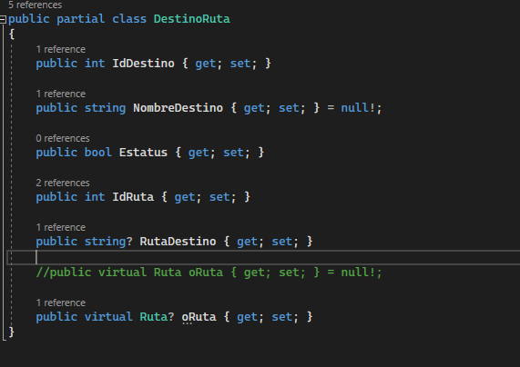

# CrudAPI
Desacoplando el Front-End 

<!-- TABLE OF CONTENTS -->
<details open="open">
  <summary>Tabla de Contenido</summary>
  <ol>
    <li>
      <a href="#Acerca del Proyecto">Acerca del Proyecto</a>
    </li>
    <li>
      <a href="#El archivo principal>El archivo principal</a>
      <ul>
        <li><a href="#Prerrequisitos">Diagramado de Interfaz grafica de usuario (GUI) Web con Balsamiq</a></li>
        <li><a href="#Prerrequisitos">Modelado de bases de datos relacionales en UML</a></li>
        <li><a href="#Prerrequisitos">Creación de la Base de Datos en SQL Managment Studio</a></li>
        <li><a href="#Prerrequisitos">Creación Proyecto con Visual Studio tipo API Web Core 6.0</a></li>
        <li><a href="#Prerrequisitos">Creación modelos mediante Object Relacional Mapping (ORM) Entitiy Framework modo Databasefirst</a></li>
        <li><a href="#Prerrequisitos">Testeo manual de end-points "Get, Post, Put, Delete" mediante Visual Code extension Postman </a></li>
	<li><a href="#Prerrequisitos">Desarrollo de Front-End Javascript</a></li>
	<li><a href="#Prerrequisitos">Creacion de Pruebas Automatizadas mediante RobotFramework</a></li>	
        <li><a href="#TODO">TODO</a></li>
        <li><a href="#Tecnologias">Tecnologías</a></li>
      </ul>
    </li>
  </ol>
</details>


# Diagrama Entidad Relación
Desacoplando el Front-End 

 

## SQL Query
 
``` sql
/* Creacion de la base de datos */
Create Database ControlAutosDB

USE [ControlAutosDB]
GO
/****** Object:  Table [dbo].[DestinoRuta]    Script Date: 9/3/2023 10:45:41 AM ******/
SET ANSI_NULLS ON
GO
SET QUOTED_IDENTIFIER ON
GO
CREATE TABLE [dbo].[DestinoRuta](
	[IdDestino] [int] IDENTITY(1,1) NOT NULL,
	[NombreDestino] [varchar](100) NOT NULL,
	[Estatus] [bit] NOT NULL,
	[IdRuta] [int] NOT NULL,
	[RutaDestino] [varchar](100) NULL,
PRIMARY KEY CLUSTERED 
(
	[IdDestino] ASC
)WITH (PAD_INDEX = OFF, STATISTICS_NORECOMPUTE = OFF, IGNORE_DUP_KEY = OFF, ALLOW_ROW_LOCKS = ON, ALLOW_PAGE_LOCKS = ON, OPTIMIZE_FOR_SEQUENTIAL_KEY = OFF) ON [PRIMARY]
) ON [PRIMARY]
GO
/****** Object:  Table [dbo].[Ruta]    Script Date: 9/3/2023 10:45:41 AM ******/
SET ANSI_NULLS ON
GO
SET QUOTED_IDENTIFIER ON
GO
CREATE TABLE [dbo].[Ruta](
	[IdRuta] [int] IDENTITY(1,1) NOT NULL,
	[NombreRuta] [varchar](60) NOT NULL,
	[RutaInicio] [varchar](60) NOT NULL,
	[Estatus] [bit] NOT NULL,
PRIMARY KEY CLUSTERED 
(
	[IdRuta] ASC
)WITH (PAD_INDEX = OFF, STATISTICS_NORECOMPUTE = OFF, IGNORE_DUP_KEY = OFF, ALLOW_ROW_LOCKS = ON, ALLOW_PAGE_LOCKS = ON, OPTIMIZE_FOR_SEQUENTIAL_KEY = OFF) ON [PRIMARY]
) ON [PRIMARY]
GO
ALTER TABLE [dbo].[DestinoRuta]  WITH CHECK ADD  CONSTRAINT [FK_Cargo] FOREIGN KEY([IdRuta])
REFERENCES [dbo].[Ruta] ([IdRuta])
GO
ALTER TABLE [dbo].[DestinoRuta] CHECK CONSTRAINT [FK_Cargo]
GOstatus nota:
--No existe el tipo de dato boolean, pero sí el tipo de dato bit. 
--Y un bit, como todos sabemos, puede ser un 1 o un 0.

/* insercion en tabla */
Insert into Ruta(NombreRuta,InicioRuta, Estatus) VALUES ('Rio Sonora','29.07447500276877, -110.94526290893555',1)

/* insercion en tabla */
Insert into DestinoRuta(Destino,NombreDestino Estatus, IdRuta) VALUES 
('29.07447500276877, -111.00105285644531',"Destino a" 1, 1),
('29.094127073996578, -110.93273162841798',"Destino b" 1,1 ),
('29.094127073996578, -110.93273162841798',"Destino c", 1)

select * from Ruta;
select * from DestinoRuta;
```
# Bosquejos

# Diagrama Diseño GUI
Bosquejos tentativos

 


# Diagrama Diseño GUI
Bosquejos tentativos

 


<!-- PROJECT LOGO -->
<br />


<p align="center">
  <a>
    
  </a>  
</p>

<p align="center">
  <a>
    
  </a>
</p>

<p align="center">
  <a>
    
  </a>
</p>

<p align="center">
  <a>
    
  </a>
</p>

<p align="center">
  <a>
    
  </a>
</p>

<p align="center">
  <a>
    
  </a>
</p>

# Creación modelos mediante Object Relacional Mapping (ORM) Entitiy Framework modo Databasefirst

1) Una vez generado el proyecto instalar con el gestor de paquetes de nutget las siguientes librerias:
"procurar que sean las versiones recientes estables"
~~~
 microsoft.entityframeworkcore.tools
 microsoft.entityframeworkcore.sqlserver  
~~~

Generar el contexto y modelos a partir de la base de datos mediante package manager console:
mediante credenciales sql:
~~~
 Scaffold-DbContext "Server=(local); Database=ControlAutosDB; user id=lorenzo; pwd= 123; Encrypt=False" Microsoft.EntityFrameworkCore.SqlServer -OutPutDir Models 
~~~

mediante autentificacion de windows:
~~~
Scaffold-DbContext "Server=(local); DataBase=ControlAutosDB; Integrated Security=true; Encrypt=False" Microsoft.EntityFrameworkCore.SqlServer -OutPutDir Models
~~~

Recuerda tener habilitada las conecciones en el administrador de sql
<p align="center">
  <a>
    
  </a>  
</p>

Al terminar deberian aparecer la carpeta models, con los modelos y el contexto generado
 [](url)

Debemos mover la cadena de \Models\ControlAutosDbContext.cs
[](url)


appsettings.json
``` json
{
  "ConnectionStrings": {
    "cadenaSql": " Server=(local); DataBase=ControlAutosDB; Integrated Security=true; Encrypt=False"
  },
  "Logging": {
    "LogLevel": {
      "Default": "Information",
      "Microsoft.AspNetCore": "Warning"
    }
  },
  "AllowedHosts": "*"
}

```

Es necesario agregar la cadena en Program.cs
~~~
builder.Services.AddDbContext<ControlAutosDbContext>(options => options.UseSqlServer(builder.Configuration.GetConnectionString("cadenaSql")));
~~~


# Generar un controller vacio con el siguiente codigo basico
``` C#
using CrudAPICM.Models;
using Microsoft.AspNetCore.Mvc;
using Microsoft.EntityFrameworkCore;

namespace CrudAPICM.Controllers
{
    [Route("api/[controller]")]
    [ApiController]
    public class ControlAutoController : Controller
    {
        private static ControlAutosDbContext _contexControlAuto;
        public ControlAutoController(ControlAutosDbContext context) { 
            _contexControlAuto = context;
        }        

        [HttpGet]
        public async Task<ActionResult<IEnumerable<Ruta>>> GetRutas() {

            return await _contexControlAuto.Ruta.ToListAsync();
        }
    }
}
```
Agregar los siguientes End-Points para el CRUD basico
``` C#
// GET: api/GetRutas
// GET: api/GetRutaId/5        
// POST: api/GetRutas
// PUT: api/PutRuta/5
// DELETE: api/DeleteRuta/5      
```

Una vez listos los end-points habilidar las politicas de dominio crusado en program.cs para poder consumir la api desde otro dominio.

``` C#
builder.Services.AddCors(options =>
{
    options.AddPolicy("PoliticaCliente",
        policy =>
        {
            policy.AllowAnyOrigin()
            .AllowAnyHeader()
            .AllowAnyMethod();
        });
app.UseCors("PoliticaCliente");
```

1) client
<p align="center">
  <a>
    
  </a>  
</p>
2) client
<p align="center">
  <a>
    
  </a>  
</p>


Si se presentan errores por cuestion de referencias cruzadas "no se pueden guardar los datos por la extension de exceso de memmoria y afecta la deserializacion mayor a 32 agregar la siguiente configuracion en program.cs file" 
``` C
// Ignorare Referencias Cruzada-
builder.Services.AddControllers().AddJsonOptions(x =>
                x.JsonSerializerOptions.ReferenceHandler = ReferenceHandler.IgnoreCycles);

```
Asegurate que cuando pruebes con swager el objeto relacionado no sea del tipo string.

<p align="center">
  <a>
    
  </a>  
</p>


Cambiar en el modelo la referencia a nula "Si no se usaran clases tipo Data tranferer object (DTO)"
<p align="center">
  <a>
    
  </a>  
</p>


PD: Lo pienso migrar a un framework basado en componetes como React
});


